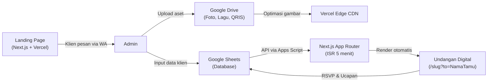
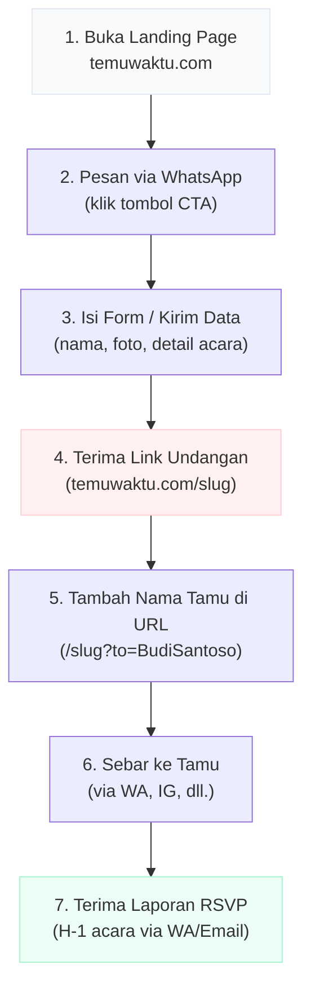
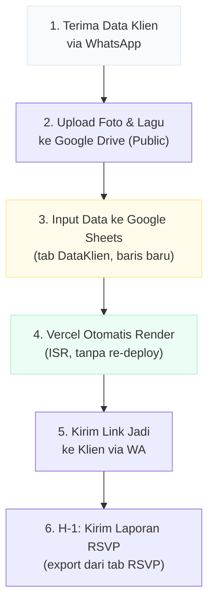

# 📋 Product Requirements Document (PRD)

## Temu Waktu — Platform Undangan Pernikahan Digital

> **Versi:** 1.0
> **Tanggal:** 24 Mei 2026
> **Status:** Active Development

---

## 1. Visi Produk & Model Bisnis

### 🎯 Visi

Menjadi platform undangan pernikahan digital **paling praktis** di Indonesia, di mana klien cukup kirim data dan foto — sisanya kami yang kerjakan.

### 💼 Model Bisnis: "100% Terima Beres"

| Aspek | Detail |
|-------|--------|
| **Tipe Layanan** | Boutique / Concierge Service |
| **Proposisi Nilai** | Klien **tidak perlu login**, tidak perlu mengatur sistem, tidak perlu paham teknologi. Cukup kirim data via WhatsApp, terima link undangan jadi. |
| **Target Pasar** | Calon pengantin yang ingin undangan digital elegan tanpa repot setup sendiri |
| **Revenue Model** | Paket layanan per-undangan (one-time fee) |

### 🏗️ Arsitektur Teknis

| Komponen | Teknologi |
|----------|-----------|
| **Frontend** | Next.js 16 (App Router), TypeScript, Tailwind CSS |
| **Database** | Google Sheets (via Google Apps Script Web App) |
| **Penyimpanan Aset** | Google Drive (foto, lagu, gambar QRIS) |
| **Hosting** | Vercel (Edge Network + Image Optimization) |
| **Caching** | ISR (Incremental Static Regeneration) — revalidasi tiap 5 menit |

---

## 2. Prioritas Fitur (MoSCoW Method)

### ✅ Must Have — *Fitur inti yang wajib ada di V1*

| # | Fitur | Deskripsi |
|---|-------|-----------|
| 1 | **Custom Nama Tamu via URL** | Parameter `?to=Nama` di URL undangan untuk personalisasi per tamu |
| 2 | **Info Acara Inti** | Tanggal, waktu, dan lokasi akad + resepsi |
| 3 | **Embed Google Maps** | Peta lokasi acara yang bisa diklik langsung untuk navigasi |
| 4 | **Form RSVP & Ucapan** | Konfirmasi kehadiran + pesan/doa → langsung masuk ke Google Sheets |
| 5 | **Galeri Foto Basic** | Grid foto prewedding dari Google Drive |
| 6 | **Sistem Ganti Tema Cepat** | Ubah kolom `theme` di Sheets → tema undangan langsung berubah tanpa re-deploy |

### 🟡 Should Have — *Penting tapi bisa menyusul*

| # | Fitur | Deskripsi |
|---|-------|-----------|
| 7 | **Amplop Digital** | Tampilkan nomor rekening + gambar QRIS untuk transfer hadiah |
| 8 | **Hitung Mundur (Countdown)** | Timer hitung mundur menuju hari H akad/resepsi |
| 9 | **Custom Backsound (MP3)** | Lagu latar dari file MP3 di Google Drive, dengan tombol play/pause |
| 10 | **Buku Tamu Virtual** | Daftar ucapan tamu yang sudah masuk, ditampilkan real-time di halaman undangan |

### 🔵 Could Have — *Nice to have jika ada waktu*

| # | Fitur | Deskripsi |
|---|-------|-----------|
| 11 | **Video YouTube** | Embed video prewedding atau dokumentasi dari YouTube |
| 12 | **Cerita Cinta (Love Story)** | Timeline perjalanan cinta mempelai |
| 13 | **Quotes Pengantar** | Kutipan ayat atau puisi romantis di pembuka undangan |

### 🔴 Won't Have — *Sengaja tidak dibuat*

| # | Fitur | Alasan |
|---|-------|--------|
| ❌ | **Dashboard Login Klien** | Bertentangan dengan model bisnis "Terima Beres". Klien tidak perlu mengakses sistem. |
| ❌ | **Custom Domain per Klien** | Menambah kompleksitas operasional. Cukup subdirectory `/slug`. |

---

## 3. Alur Kerja (User & Admin Flow)

### 👰 Sisi Klien

### 🛠️ Sisi Admin

**Poin penting:**
- Admin **tidak perlu menyentuh kode** sama sekali
- Menambah klien baru = menambah 1 baris di Google Sheets
- Vercel akan otomatis merender halaman baru saat ada visitor pertama (ISR)
- Mengganti tema = ubah nilai kolom `theme` di Sheets

---

## 4. Struktur Database (Google Sheets)

### 📊 Tab: `DataKlien`

| Kategori | Kolom | Tipe | Contoh | Keterangan |
|----------|-------|------|--------|------------|
| **Data Dasar** | `slug` | string | `andi-nina` | URL unik, huruf kecil, tanpa spasi |
| | `theme` | string | `elegant` | ID tema (`elegant`, `rustic`, dll.) |
| | `hero_image` | URL | `https://drive.google.com/...` | Foto cover utama dari G-Drive |
| | `music_url` | URL | `https://drive.google.com/...` | File MP3 backsound dari G-Drive |
| **Profil Mempelai** | `bride_full_name` | string | `Nina Sari Dewi` | Nama lengkap mempelai wanita |
| | `bride_nickname` | string | `Nina` | Nama panggilan |
| | `groom_full_name` | string | `Andi Pratama` | Nama lengkap mempelai pria |
| | `groom_nickname` | string | `Andi` | Nama panggilan |
| **Akad** | `akad_date` | date | `2026-12-31` | Format: YYYY-MM-DD |
| | `akad_time` | string | `08:00 - 10:00 WIB` | Rentang waktu akad |
| | `akad_location` | string | `Masjid Istiqlal, Jakarta` | Nama tempat akad |
| | `akad_map_url` | URL | `https://maps.google.com/...` | Link Google Maps lokasi akad |
| **Resepsi** | `resepsi_date` | date | `2026-12-31` | Format: YYYY-MM-DD |
| | `resepsi_time` | string | `11:00 - 14:00 WIB` | Rentang waktu resepsi |
| | `resepsi_location` | string | `Gedung Serbaguna, Jakarta` | Nama tempat resepsi |
| | `resepsi_map_url` | URL | `https://maps.google.com/...` | Link Google Maps lokasi resepsi |
| **Amplop Digital** | `bank_name` | string | `BCA` | Nama bank untuk transfer |
| | `bank_account` | string | `1234567890` | Nomor rekening |
| | `account_owner` | string | `Andi Pratama` | Nama pemilik rekening |
| | `qris_image` | URL | `https://drive.google.com/...` | Gambar QRIS dari G-Drive |
| **Galeri** | `gallery_images` | string | `url1, url2, url3` | URL foto G-Drive, dipisahkan koma |

### 📊 Tab: `RSVP`

| Kolom | Tipe | Contoh | Keterangan |
|-------|------|--------|------------|
| `slug` | string | `andi-nina` | Merujuk ke undangan klien mana |
| `nama_tamu` | string | `Budi Santoso` | Nama tamu yang mengisi RSVP |
| `kehadiran` | string | `Hadir` / `Tidak Hadir` | Konfirmasi kehadiran |
| `pesan` | string | `Selamat menempuh hidup baru!` | Ucapan & doa |
| `timestamp` | datetime | `2026-12-25 14:30:00` | Otomatis ditambahkan oleh Apps Script |

---

## 5. Catatan Teknis

> [!NOTE]
> **ISR (Incremental Static Regeneration)**: Data di-cache selama 5 menit di Vercel. Artinya, setelah admin mengubah data di Sheets, perubahan akan muncul di website dalam maksimal 5 menit tanpa perlu deploy ulang.

> [!NOTE]
> **Google Drive Sharing**: Semua file (foto, lagu, QRIS) harus di-set ke **"Anyone with the link"** agar bisa diakses oleh Next.js Image Optimization.

> [!WARNING]
> **Rate Limiting**: Google Apps Script memiliki quota 20.000 request/hari. Dengan ISR 5 menit, satu undangan hanya menggunakan ~288 request/hari. Aman untuk puluhan klien secara bersamaan.

---

*Dokumen ini adalah sumber kebenaran (source of truth) untuk pengembangan produk Temu Waktu. Semua keputusan fitur dan teknis harus mengacu pada dokumen ini.*
