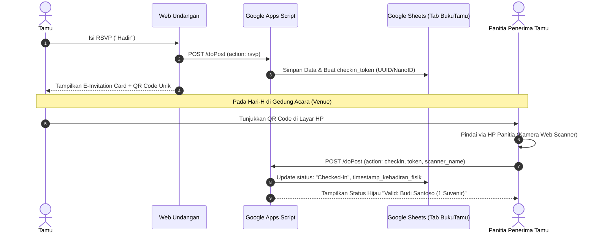

# Spesifikasi Fitur Masa Depan: QR Code Check-In Tamu Venue

Dokumen ini merancang arsitektur dan alur kerja fitur QR Check-In Tamu untuk implementasi tahap selanjutnya (V2).

---

## 1. Masalah & Kebutuhan Pengantin
Saat hari-H pernikahan, pengantin dan panitia resepsi sering menghadapi kendala:
1. **Antrean Buku Tamu Fisik**: Menulis nama manual di meja penerima tamu memakan waktu lama dan menyebabkan antrean panjang.
2. **Kekeliruan Jumlah Suvenir**: Tamu yang tidak diundang atau mengambil suvenir ganda tanpa verifikasi.
3. **Pencatatan Kehadiran Fisik**: Klien ingin tahu secara pasti siapa saja dari daftar RSVP yang benar-benar datang ke gedung resepsi.

---

## 2. Alur Sistem (System Flow)

---

## 3. Skema Data (Data Schema)

Tab baru pada Google Sheets: `CheckInTamu`
| Kolom | Nama Field | Tipe | Contoh Data | Deskripsi |
|---|---|---|---|---|
| A | `token` | String | `CHK-7X9B21` | Token hash unik per tamu |
| B | `slug` | String | `desti-anton` | Slug Klien |
| C | `nama_tamu` | String | `Budi Santoso & Istri` | Nama Tamu |
| D | `pax` | Integer | `2` | Jumlah alokasi orang |
| E | `suvenir_claim` | Integer | `1` | Kuota suvenir |
| F | `status` | String | `Pending` / `Checked-In` | Status kehadiran fisik |
| G | `checkin_time` | Timestamp | `2026-12-31 11:24:02` | Waktu scan di venue |
| H | `scanner_by` | String | `Meja 1 - Sarah` | Petugas penerima tamu |

---

## 4. Komponen Frontend yang Dibutuhkan di V2
1. **Tampilan QR di Undangan**:
   - Generator SVG QR Code ringan (misal `@paulmillr/qr` atau `qrcode.react`) di kartu RSVP Tamu.
2. **Halaman Scanner Panitia**:
   - Rute terproteksi PIN: `/[slug]/scan`.
   - Menggunakan HTML5 QR Scanner (`html5-qrcode`) yang berjalan langsung di browser HP tanpa perlu instal aplikasi Android/iOS.
